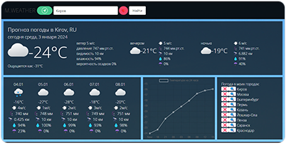
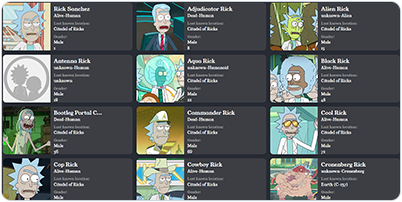

### :boy: About me:
#### As you can see my name Dima. Nice to meet you. As i remembering myself always was interested in computers and programs. I am studying to be a programmer at the university and I learn programming on my own, with great interest.

### :hammer_and_wrench: My technology stack:

### :placard: Pet projects demo:

<!-- [M.Weather](https://dexone.github.io/M.Weather/) | [RM](https://github.com/Dexone/rick_morty) | [Crytpocurrency](https://github.com/Dexone/vue-cryptocurrency) |
--- | --- | ---
 |   |    | -->

  