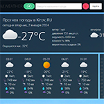
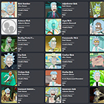

## :hammer_and_wrench: My technology stack:
| |  | |  | | | |
|:------:|:------:|:------:|:------:|:------:|:------:|:------:|
| |  |  | | | 	| 

## :placard: Pet projects demo:

[M.Weather](https://dexone.github.io/M.Weather/) | [RM](https://github.com/Dexone/rick_morty) |
--- | --- 
 |   |